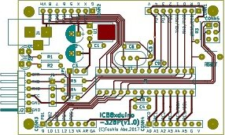
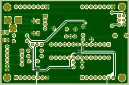

ICB8xduino-328p(kicadプロジェクト一式)
====

ボードサイズをサンハヤト社製のICB-86,ICB-87のサイズに合わせたArduino互換基板です。
Arduino上でハードウェアのプロトタイプ作成者向けのボードになります。

目的とするシールドが無い場合は、ハードウェアの実装が必要になります。
が、下記のような問題に直面すると思います。

- 専用のユニバーサル基板を使用しなければならない
- 専用のユニバーサル基板の種類が限られる
- 100milピッチではないコネクタのため、アートワークが困難

本基板は、上記を考慮し、Arduinoプラットフォーム上で、
ハードウェア・プロトタイプ開発の手助けができれば幸いです。

## 特徴
- サイズはICB-86,ICB-87相当としています
- 基板の角のそれぞれにATmega328pのピンを全てアサインしています  
  また、ICB-86,ICB-87のコネクタパターンに合うよう配置しています

## 仕様
- ATmega328pで動作します
- クロックは16MHzクリスタル・レゾネータ及びインターナルクロック(8MHz)で動作可能です
- デジタルとアナログの電源はジャンパで分離しています
- 電源はUSBシリアル変換アダプター、ACアダプタ(コネクタ上のVINも含む)です  

## 使用方法
### 内容について
- kicadのプロジェクトファイル一式が入れられております
- ガーバーデータ等はkicadにて作成願います

### [回路図](ICB8xduino-328p.pdf)

### パターン
- 前面  
  

- 背面  
  

### 部品表
|No. |Reference	 |部品名                                      |
|---:|:----------|:-------------------------------------------| 
|1   |C1	       |積層セラミックコンデンサ 0.1μF             |
|2   |C2       	 |電解コンデンサ 47μF                        |
|3   |C3         |電解コンデンサ 47μF                        |
|4   |C4         |積層セラミックコンデンサ 0.1μF             |
|5   |C5  	     |積層セラミックコンデンサ 22pF               |
|6   |C6	       |積層セラミックコンデンサ 22pF               |
|7   |C7	       |積層セラミックコンデンサ 0.1μF             |
|8   |C8         |積層セラミックコンデンサ 0.1μF             |
|9   |C9 	       |積層セラミックコンデンサ 0.1μF             | 
|10  |CONN1      |1x8 2.54mmピッチ ピンフレーム               |
|11  |CONN2	     |1x8 2.54mmピッチ ピンフレーム               |
|12  |CONN3	     |1x8 2.54mmピッチ ピンフレーム               |
|13  |CONN4	     |1x8 2.54mmピッチ ピンフレーム               |
|14  |CONN5	     |2x3 2.54mmピッチ ピンヘッダ                 | 
|15  |D1	       |3mm LED(赤)                                 |
|16  |D2	       |3mm LED(緑)                                 |
|17  |J1	       |2.1mm標準DCジャック                         |
|18  |J2 	       |1x6 2.54mmピッチ ピンヘッダ(L型)            |
|19  |(J4)       |秋月電子 AE-FT234X 用端子                   |
|20  |JP1	       |2x3 2.54mmピッチ ピンヘッダ                 |
|21  |(JP1)      |2.54ピッチ・ジャンパーピン                  |
|22  |R1      	 |炭素皮膜抵抗器 10KΩ 1/4W (茶黒橙)          |
|23  |R2  	     |炭素皮膜抵抗器 330Ω 1/4W (橙橙茶)          |
|24  |R3	       |炭素皮膜抵抗器 10KΩ 1/4W (茶黒橙)          |
|25  |R4	       |炭素皮膜抵抗器 330Ω 1/4W (橙橙茶)          |
|26  |R5	       |炭素皮膜抵抗器 330Ω 1/4W (橙橙茶)          |
|27  |SW1	       |タクトスイッチ                              |
|28  |U1	       |三端子レギュレータ 5V0.5A                   |
|29  |U2	       |ATMEGA328P-PU                               |
|30  |(U2)       |ICソケット(28ピン,300mil)                   |
|31  |Y1         |水晶振動子(16MHz)又はセラミック発振子(16MHz)|


### 実装
- GS1,GS2はハンダで接続してください。
- 内蔵クロックを使用する場合は、C5,C6及びクリスタルの実装は必要ありません。
- レゾネータを使用する場合は、C5,C6の実装は必要ありません。
- 電源をDCアダプタ(VIN端子含む)・USBシリアル変換アダプターのどちらかを、  
  ジャンパーで選択してください(回路図中JP1)
- Arduinoとして使用する場合は、AVRISP mk2でブートローダを書き込んでください  
  ブートローダ書き込み済のマイコンを使用する場合は不要です。また、
  ISCP端子も不要です
- ACアダプタの電源は三端子レギュレータの仕様に従ってください  
  本回路では12〜35Vを想定してます、

### ブートローダー書込
Arduinoとして使用する場合は、ブートローダーを書き込んでください  
※AVRISP mk2で書き込む場合

#### クリスタル、レゾネーターで使用する場合
```
avrdude \
-P usb            \
-b 19200          \
-c avrisp2        \
-p m328p          \
-v -e             \
-U efuse:w:0xFD:m \
-U hfuse:w:0xD6:m \
-U lfuse:w:0xFF:m

avrdude \
-P usb            \
-b 19200          \
-c avrisp2        \
-p m328p          \
-v -e             \
-U efuse:w:0xFD:m \
-U hfuse:w:0xD6:m \
-U lfuse:w:0xFF:m

```

#### 内蔵クロックで使用する場合
```
avrdude \
-P usb            \
-b 19200          \
-c avrisp2        \
-p m328p          \
-v -e             \
-U efuse:w:0xFD:m \
-U hfuse:w:0xDA:m \
-U lfuse:w:0xE2:m

avrdude           \
-P usb            \
-b 19200          \
-c avrisp2        \
-p m328p          \
-v -e             \
-U lock:w:0xCF:m  \
-U flash:w:ATmegaBOOT_168_atmega328_pro_8MHz.hex
```
### スケッチ書き込み(Arduino IDE)
- スケッチの書き込みはUSBシリアル変換アダプターを使用してください  
  ピンアサインはArduino Proと同等にしてあります
- ボードの選択は下記の通りです
  - クリスタル、レゾネータの場合
    - ボード：Arduino/Genuino UNO
  - 内蔵クロックの場合
    - ボード；Arduino Pro or Pro mini
    - プロセッサ：ATmega328P(3.3V, 8MHz)
- シリアルポートはUSBシリアル変換アダプターのポートを使用してください

## コネクタ
### CONN1
|No  |Aduino |ATmega328p |Pin |備考 |
|---:|-------|-----------|---:|-----|
|1   |GNDD   |GND        |8   |     |
|2   |RESET  |#RESET     |1   |     |
|3   |0      |PD0/RXD    |2   |     |
|4   |1      |PD1/TXD    |3   |     |
|5   |2      |PD2        |4   |     |
|6   |3      |PD3        |5   |     |
|7   |4      |PD4        |6   |     |
|8   |VDD    |VCC        |7   |     |

### CONN2
|No  |Aduino |ATmega328p |Pin |備考                     |
|---:|-------|-----------|---:|-------------------------|
|1   |GNDD   |GND        |8   |                         |
|2   |XTAL1  |PB6        |9   |内蔵クロックのみ使用可能 |
|3   |XTAL2  |PB7        |10  |内蔵クロックのみ使用可能 |
|4   |5      |PD5        |11  |                         |
|5   |6      |PD6        |12  |                         |
|6   |7      |PD7        |13  |                         |
|7   |8      |PB0        |14  |                         |
|8   |VIN    |VIN        |-   |３端子レギュレータ入力   |

### CONN3
|No  |Aduino |ATmega328p |Pin |備考         |
|---:|-------|-----------|---:|-------------|
|1   |9      |PB1        |15  |             |
|2   |10     |PB2/SS     |16  |             |
|3   |11     |PB3/MOSI   |17  |             |
|4   |12     |PB4/MISO   |18  |             |
|5   |13     |PB5/SCK    |19  |             |
|6   |VCC    |AVCC       |20  |アナログ電源 |
|7   |AREF   |AREF       |21  |             |
|8   |GNDA   |GND        |22  |アナログ電源 |

### CONN4
|No  |Aduino |ATmega328p |Pin |備考 |
|---:|-------|-----------|---:|-----|
|1   |A0     |PC0        |23  |     |
|2   |A1     |PC1        |24  |     |
|3   |A2     |PC2        |25  |     |
|4   |A3     |PC3        |26  |     |
|5   |A4     |PC4/SDA    |27  |     |
|6   |A5     |PC5/SCL    |28  |     |
|7   |GNDD   |GND        |8   |     |
|8   |VDD    |VCC        |7   |     |

## ライセンス

  
基板のアートワークについては[クリエイティブ・コモンズ 表示 - 非営利 4.0 国際 ライセンス](http://creativecommons.org/licenses/by-nc/4.0/)の下に提供されています。